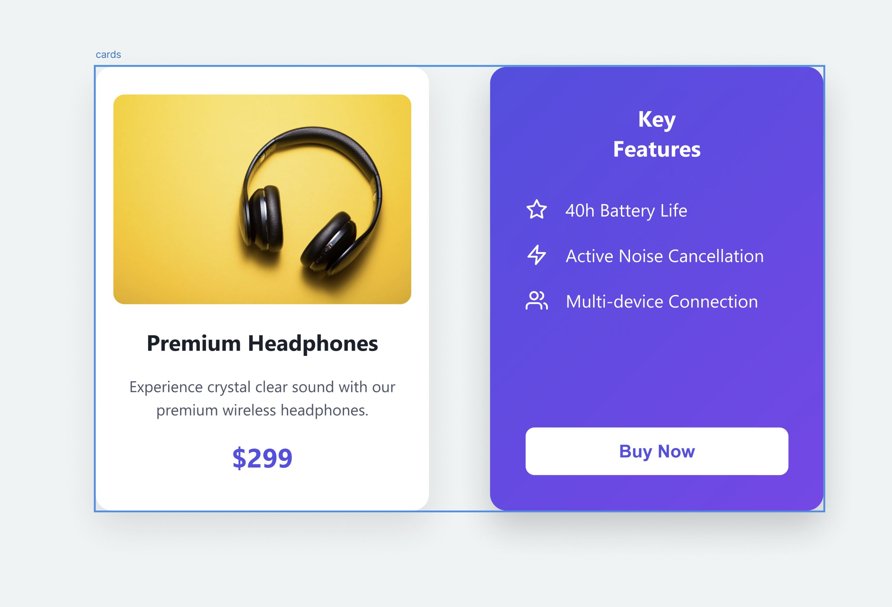

# Modern Flip Card

Welcome to the **Modern Flip Card** project! This project showcases a 3D flip card effect using only HTML and CSS, without any JavaScript. The design was first prototyped in Figma and then transformed into code.



## Project Overview

This modern flip card provides an engaging, interactive experience, ideal for showcasing products or services. It features:

- A **premium look** with front and back faces.
- **Smooth animations** when flipping between sides.
- **Responsive design**, optimized for smaller devices.
- **3D effect** using pure CSS, no JavaScript required.

## Features

1. **Front and Back Faces**: The front side displays an image, product name, description, and price. The back side reveals key features and a "Buy Now" button.

2. **3D Rotation**: When the card is hovered over, it flips smoothly to reveal the back.

3. **Pure CSS Implementation**: This project was built with HTML and CSS only. No JavaScript libraries or frameworks were used.

## How to Use

Simply clone the repository and open the `index.html` file in your browser to see the flip card in action.

```sh
# Clone this repository
git clone <repository_url>

# Open the project
double-click index.html or open it with your preferred web server.
```

## Design Inspiration

The flip card was initially designed in Figma, allowing for a detailed and visually appealing prototype. We then converted the design into a live HTML/CSS implementation.

## Watch the Full Tutorial

For a detailed step-by-step guide on how we designed and coded this modern flip card, check out my YouTube channel:

[Watch the Flip Card Tutorial](https://www.youtube.com/channel/your_channel_link)

Make sure to **like, share, and subscribe** for more tutorials on modern web design!

## Preview


## License

This project is licensed under the MIT License - see the [LICENSE](LICENSE) file for details.

## Connect with Me

- [YouTube Channel](https://www.youtube.com/channel/your_channel_link) - Tutorials on web design and development.
- [Figma Designs](https://figma.com/your_figma_profile) - Follow for upcoming project designs.
